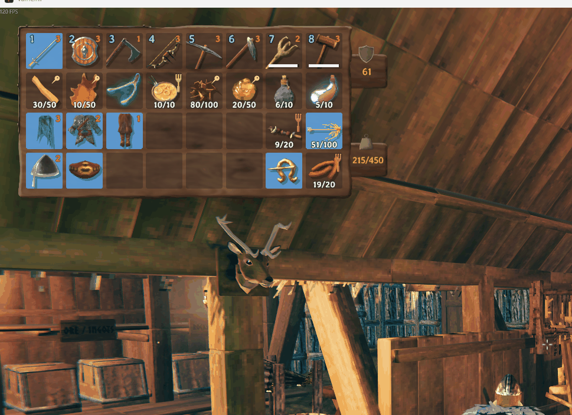

# Nearby Chests

[](https://github.com/timothydodd/valheim-nearby-chests/actions/workflows/build.yml)

A client-side [BepInEx](https://github.com/BepInEx/BepInEx) mod for Valheim. It lets you craft and
build straight from nearby chests, and makes the Stack button put your items away into the right
chests for you.

## Features

To restrict automatic operations to selected chests, enable `OnlyUseMarkedChests`, then open each
chest and tick **Include in NearbyChests**. Existing and newly built chests start unmarked. The
restriction is off by default; ordinary manual transfers remain available either way.

1. **Craft and build from nearby chests.** Workbench/forge recipes, upgrades, and hammer builds
   can use materials sitting in chests within reach (30 m by default). The requirement counts in the
   crafting panel and build menu include those chests. Items you carry are spent first. After that the
   rest comes from the closest chests.
2. **Feed stations from chests.** Coal and ore into smelters and kilns, wood into fires and
   hearths, fuel into cooking stations and ovens. If you're not carrying it, it comes out of a nearby
   chest within crafting range. One press adds one item, the same as vanilla. Food and mead stay
   manual: a cooking station takes several different dishes and a fermenter one mead base at a time,
   so the mod would be picking for you.
3. **Stack to every nearby chest.** With a chest open, pressing **Stack** (or holding **E** on a
   chest) sends each stackable item in your inventory to every nearby chest that already holds
   that item (15 m by default). The chest you're using gets first pick if it's eligible. Using an
   unmarked chest can still send items to marked neighbours; it never marks the chest automatically.
4. **New items find a home.** If no nearby chest holds an item yet (or its chests are full), the mod
   looks for somewhere similar:
   1. **A chest with similar items.** It picks the nearby chest holding the most items from the same
      group: metals, hides, wood, stone, raw ingredients, plants, cooked food, seeds, trophies, or
      materials from the same biome (Black Forest, Mountains and Swamp, Plains and Ocean, and so on).
      Items in no group at all share a single **catch-all chest** rather than taking a chest each.
   2. **An empty chest.** This step is enabled unless `DontFillEmptyChests` is turned on. The eligible
      chest you're using comes first if it's empty, then the nearest. That chest becomes the group's
      home next time.
   3. **A shared chest.** If no empty chest can be used, a chest holding only one group takes this
      item's group as a second one, preferring a related group.
   4. **Your inventory.** If there's still nowhere to go, the item stays with you, and the on-screen
      message tells you how many were left over.
5. **Tidy chests.** Every chest that receives items gets its partial stacks merged and its
   contents sorted by type, then group, then name.
6. **Tidy button.** The chest window gets a small **Tidy** icon (three bars) just left of Place
   stacks. It cleans out the eligible chest you have open; with marked-only use enabled, Tidy does
   nothing to an unmarked chest:
   - The chest's category is whichever group it holds the most of, for example Metals.
   - Anything that doesn't match moves to a nearby chest of its own category.
   - If there's no chest for that category and `DontFillEmptyChests` is off, it goes into an
     **empty chest**, which becomes that category's chest from then on.
   - If no empty chest can be used, it **shares a chest**: a chest holding just one group takes a
     second one, preferring a related group (the one listed next to it in the groups file, so Raw
     pairs with Plants and Wood with Stone). A chest holding exactly two groups counts as home for
     both, so Tidy leaves it alone.
   - Failing that, it goes to the **catch-all chest**: a chest that's mostly uncategorized items (materials
     that aren't in any group).
   - Anything left over stays where it is.
   - It also **gathers strays**: items of this chest's category are pulled in from chests where they
     don't belong (a shared chest's second group, a few bars in the wood chest, the catch-all chest).
     A group split over two chests is merged: whichever chest holds the most of it keeps it, and the
     chest you have open wins a tie.
   - Afterwards the chest is sorted.

7. **Ignore a slot.** With your inventory open, **middle-click** a slot to mark it: a small pin appears
   in its corner, and Stack never touches whatever is in that slot. Middle-click again to clear it.
   The mark belongs to the slot, not the item, so a reserved slot stays reserved whatever you put in
   it, and marks are saved with your character.

   
8. **Pull build materials.** With a piece selected on your hammer (or hoe, cultivator...),
   **Ctrl + left click** pulls that piece's materials out of nearby chests into your inventory, ready
   to carry somewhere out of range. Each press adds enough for one more piece on top of what you
   already carry, and the click doesn't place anything. The on-screen message says what was pulled,
   and what the chests were short of.

9. **Stack and tidy nearby chests.** Assign `StackAndTidyKey` in the config to stack your inventory
   once, then tidy each eligible chest within `StackingRange`, nearest first. No chest needs to be
   open. The shortcut respects chest marks, empty-chest protection, item exclusions and Tidy settings,
   and shows one summary. It starts unbound (`None`), works independently of `StackToNearby` and
   `TidyButton`, and does not repeat while held or activate while menus, inventory or chat are open.

Stacking leaves these in your inventory. Each has its own setting, and all are on by default:
- **Food, meads and potions:** anything cooked, baked, crafted or brewed. Edible things you pick or
  harvest (berries, mushrooms, honey and so on) count as ingredients and still get stacked.
- **Ammo:** arrows, bolts, bait.
- **Equipment:** weapons, armor, shields, tools, torches, utility items, trinkets.
- **Your hotbar** (the top row), and anything you have equipped.

Chests the mod never touches:
- The Obliterator.
- Gravestones.
- Dungeon loot chests.
- Chests another player has open.
- Chests you can't open yourself (private, or behind someone else's ward).

Crafting and stacking have separate ranges: `CraftingRange` (30 m) covers crafting, upgrading and
building, while `StackingRange` (15 m) covers Stack, Tidy and sorting, so putting things away only
touches the chests around you.

Carts and ships are off by default.

## Install

**With a mod manager:** install [Nearby Chests from Thunderstore](https://thunderstore.io/c/valheim/p/TeamRobo/Nearby_Chests/)
with r2modman or Thunderstore Mod Manager. BepInEx comes along as a dependency.

**By hand:** download the latest zip from [Releases](https://github.com/timothydodd/valheim-nearby-chests/releases):

| File | Use it when |
|---|---|
| `NearbyChests-x.y.z-with-BepInEx.zip` | You don't have BepInEx yet. Includes BepInEx, already laid out for the game folder. |
| `NearbyChests-x.y.z.zip` | You already have BepInEx installed. |

1. Open your Valheim folder, the one with `valheim.exe` in it. In Steam, that's *right-click
   Valheim → Manage → Browse local files*.
2. Extract the zip straight into that folder. Windows' *Extract All* suggests a new folder named
   after the zip, so delete that last part of the path before you extract.
3. Check the result: `winhttp.dll`, `doorstop_config.ini` and the `BepInEx\` folder must sit
   **right next to `valheim.exe`**. If they're one folder too deep, BepInEx never loads.
4. Launch the game. To check it loaded, open `BepInEx\LogOutput.log` and look for
   `Nearby Chests x.y.z loaded`.

**Getting BepInEx from Thunderstore instead?** The
[BepInExPack_Valheim](https://thunderstore.io/c/valheim/p/denikson/BepInExPack_Valheim/) zip has a
`BepInExPack_Valheim` folder inside it. Copy what's *inside* that folder into your Valheim folder,
not the top of the zip, which only holds Thunderstore's `manifest.json`, `icon.png` and README.
Then extract the mod-only zip on top.

To uninstall, delete `BepInEx\plugins\NearbyChests`. To remove BepInEx entirely, also delete
`winhttp.dll` from the Valheim folder.

## Configuration

After the first launch, settings are in `BepInEx\config\NearbyChests.cfg`:

| Section  | Setting               | Default              | What it does                                                                                                                                               |
|----------|-----------------------|----------------------|------------------------------------------------------------------------------------------------------------------------------------------------------------|
| General  | OnlyUseMarkedChests   | false                | Only use chests marked with Include in NearbyChests. Applies to all automatic deposits and withdrawals.                                                    |
| General  | IncludeCartsAndShips  | false                | Also use cart and ship storage.                                                                                                                            |
| Crafting | CraftingRange         | 30                   | Distance in meters a chest can be and still be used for crafting, upgrading and building (3–60).                                                           |
| Crafting | CraftFromChests       | true                 | Use chest materials at crafting stations.                                                                                                                  |
| Crafting | BuildFromChests       | true                 | Use chest materials when building.                                                                                                                         |
| Crafting | StationsFromChests    | true                 | Take fuel and ore from chests when feeding smelters, kilns, fires and cooking stations. Food and mead stay manual.                                         |
| Stacking | StackingRange         | 15                   | Distance in meters a chest can be and still be used by Stack, Tidy and sorting (3–60).                                                                     |
| Stacking | StackAndTidyKey       | None                 | Stack your inventory, then tidy all eligible chests within StackingRange once. Assign a key combination to enable.                                         |
| Stacking | StackToNearby         | true                 | Stack button and hold-to-stack use eligible nearby chests. Turn off for vanilla stacking into the target chest; the marked-only restriction still applies. |
| Stacking | KeepHotbar            | true                 | Never stack items from the top row.                                                                                                                        |
| Stacking | ExcludeFood           | true                 | Never stack food, meads or potions (anything cooked, crafted or brewed). Raw ingredients still stack.                                                      |
| Stacking | ExcludeAmmo           | true                 | Never stack arrows, bolts, bait or other ammo.                                                                                                             |
| Stacking | ExcludeEquipment      | true                 | Never stack weapons, armor, shields, tools, torches, utility items or trinkets.                                                                            |
| Stacking | PlaceUnassignedItems  | true                 | Items with no home go to a chest of similar items, or an empty chest when DontFillEmptyChests is off.                                                      |
| Stacking | DontFillEmptyChests   | false                | Don't automatically deposit into completely empty chests, even when marked. Applies immediately.                                                           |
| Stacking | UnassignedItemTypes   | Material,Trophy      | Item types placed even when not in the groups file. They share the catch-all chest. Other options: Consumable, Ammo, AmmoNonEquipable, Fish, Misc.         |
| Stacking | FallbackToOpenChest   | false                | Use the eligible open chest as a last resort. Respects OnlyUseMarkedChests and DontFillEmptyChests.                                                        |
| Stacking | SortAfterStack        | true                 | Sort and merge chests that received items.                                                                                                                 |
| Stacking | ShareChests           | true                 | When a group has no chest and no empty chest can be used, let a one-group chest take a second, related group.                                              |
| Stacking | TidyButton            | true                 | Show the Tidy button in the chest window (restart to apply).                                                                                               |
| Stacking | TidyGathers           | true                 | Tidy also pulls stray items of this chest's category in from other chests.                                                                                 |
| Stacking | IgnoreSlots           | true                 | Middle-click a slot in your inventory to mark it ignored; Stack never moves what's in it.                                                                  |
| Building | PullBuildMaterials    | true                 | With a piece selected, the key below pulls its materials from nearby chests into your inventory.                                                           |
| Building | PullBuildMaterialsKey | Mouse0 + LeftControl | The key (with modifiers) that pulls materials. Default is Ctrl + left click.                                                                               |
| Building | PullBuildSets         | 1                    | How many pieces' worth of materials each press adds (1–50).                                                                                                |

### Item groups

Groups live in `BepInEx\config\NearbyChests.groups.txt`, one line per group:

```
Metals = CopperOre, Copper, CopperScrap, TinOre, Tin, Bronze, ...
Raw = RawMeat, DeerMeat, ..., ChickenEgg, Honey, ...
Plants = Raspberry, Blueberries, Mushroom, Carrot, ..., BarleyFlour, Spice*
Cooked = Cooked*, BakedPoteitr, BoarJerky, Bread, ...
Trophies = Trophy*
```

- **Names:** item prefab names (the ones the `spawn` console command uses). Not case sensitive.
- **Wildcards:** a trailing `*` matches any name starting with that text.
- **Order:** if an item is listed twice, the first group wins.
- **Always placed:** anything listed is placed even if its type isn't in `UnassignedItemTypes`.
  Meads and coins aren't listed, so they only move when a chest already holds them. Food, ammo and
  equipment are never stacked while their `Exclude...` settings are on, whatever group they're in.
- **Live edits:** changes apply the next time you stack, with no restart needed.
- **Resetting:** delete the file to get the latest defaults back.

## How it works

The mod is written in C# and uses [Harmony](https://github.com/pardeike/Harmony) patches, like
most Valheim mods.

**Chest selection** (`ChestSelection.cs`) adds the checkbox to the existing chest panel and stores
`NearbyChests.Included` as a boolean on the chest's ZDO. Vanilla networking and world saves carry
this field; no server mod or custom protocol is needed. The checkbox writes only while the chest is
open locally, accessible, and already network-owned locally. It changes metadata without saving the
inventory or claiming ownership. Network ownership is separate from the player who placed the chest.

`ChestFinder` applies the shared mark check alongside its existing range, access and busy-chest
checks. Direct open-chest paths are guarded too, and mutations recheck the mark before claiming
ownership. Local mark edits and `OnlyUseMarkedChests` changes invalidate the chest and count caches;
a `ZDO.Deserialize` patch does the same when a changed mark arrives from another client.
`DontFillEmptyChests` is checked at deposit time in the shared `Stacker.MoveInto` method, including
Tidy transfers and open-chest fallback.

**Crafting from chests** doesn't rewrite any of Valheim's crafting logic. The game already has
methods that check whether you have a recipe's requirements (`Player.HaveRequirementItems`,
`Player.HaveRequirements(Piece, ...)`, `Player.GetFirstRequiredItem`,
`InventoryGui.SetupRequirement`) and methods that spend them (`Player.ConsumeResources`,
`InventoryGui.DoCrafting`). The mod marks when the game is inside one of those, with a "count scope"
and a "consume scope". While a scope is active, calls on the local player's inventory are extended
to nearby chests:

- `Inventory.CountItems` / `HaveItem` add chest totals.
- `Inventory.GetItem` falls back to a chest item.
- `Inventory.RemoveItem(name, ...)` takes whatever the player is short of from chests, nearest first.

Outside those scopes, the inventory behaves exactly like vanilla. That keeps the patches small, and
recipe changes in game updates mostly just work. Nearby chest lookups and item counts are cached for
a second because the crafting and build menus ask many times per frame. Chest-content changes
invalidate item counts; selection changes invalidate both caches.

**Feeding stations** (`StationPatches.cs`) needs no station logic of its own, because adding fuel or
ore is the game asking the player's inventory "do you have this?" and then "take one" - the same
calls the crafting scope already extends to chests. The mod marks the station interaction
(`Switch.Interact`/`UseItem`, which covers smelters, kilns, windmills, spinning wheels, eitr
refineries, shield generators and the cooking station's fuel switch, plus `Fireplace` directly) and
lets those patches do the rest. A cooking station's add-food switch is skipped, and `CookingStation`
and `Fermenter` aren't patched at all, so food and mead stay manual. Ore is the exception: the game
finds it with `Inventory.GetItem(name)` and spends it with `RemoveItem(item, 1)`, passing the item
instance. When the fallback hands back an item living in a chest, that call would find nothing to
remove, so a patch on the instance overloads removes it from the chest it actually came from.

**Stacking** replaces the game's stack action where it's triggered: `InventoryGui.OnStackAll` (the
button) and `Container.RPC_StackResponse` (holding Use on a chest). For each eligible item the mod:

1. fills chests that already contain it,
2. fills the chest holding the most items from the same group (`ItemGroups.cs`), or, for items in no
   group, the catch-all chest (the one that's mostly ungrouped items),
3. fills an eligible empty chest when `DontFillEmptyChests` is off,
4. tries a one-group chest when `ShareChests` is on,
5. optionally falls back to the eligible open chest (`FallbackToOpenChest`), respecting the empty-chest setting.

Chests that received items are then merged and sorted by type, group order, name, quality and stack
size.

**Ignored slots** (`IgnoredSlots.cs`) hang off the player grid: a postfix on `InventoryGrid.UpdateGui`
adds a pin image to each slot element the first time it sees it and hooks the element's
`UIInputHandler.m_onMiddleClick`, which the game leaves unused. The slot list is kept in the
character's custom data (`Player.m_customData`), so it saves with the character, and `Stacker` skips
any item whose grid position is marked.

**Pulling build materials** (`BuildPull.cs`) is a prefix on `Player.UpdatePlacement`. When the
shortcut is pressed in build mode it reads the selected piece's requirements, works out how many
pieces you could already build from what you carry, and moves the shortfall for one more from the
nearest chests into your inventory. It then clears the frame's input flag so the click doesn't also
place the piece.

**Tidy** (`Tidier.cs`) adds its button by cloning the chest window's Stack button in an
`InventoryGui.Awake` postfix. The clone is resized to a square, and its label is swapped for an icon
drawn at runtime (`TidyIcon`). Its `UIGamePad` shortcut is removed so a controller press doesn't fire
both buttons. The first time the
chest window is shown, it's positioned just left of Stack using world-space corners, so it lines up
at any resolution or UI scale.
Each nearby chest's category is its most common group by stack count. Uncategorized items count as
"junk", and ties go to the group listed first. Items in the open chest that don't match its category
move to:
1. chests of their category (dedicated chests first, then two-group chests holding it),
2. an empty chest when `DontFillEmptyChests` is off, which takes on that category,
3. a one-group chest, which becomes a shared chest (closest group in file order first),
4. junk chests.

Then it gathers: items of the chest's own category are pulled out of eligible nearby chests whose own
category differs, which covers shared chests, strays and junk chests. Another chest of the same
category is drained too, unless it holds more of the category than the open one, so a split group
merges into one chest and can't bounce back on the next tidy.

A chest holding exactly two groups keeps its second group when there's no better home, so shared
chests don't bounce items back and forth. A junk chest never passes items on to another junk chest,
and uncategorized items never become a shared chest's second group.

**Food detection:** an item counts as food when it's a `Consumable` that the game can produce, meaning
it's the output of an `ObjectDB` recipe or of a `CookingStation` (including ovens), `Fermenter` or
`Smelter` conversion. Raw edibles aren't produced by anything, so they stay ingredients. This works
with modded recipes too. "Isn't a recipe ingredient" was tried first, but it fails because cooked
dishes like deer stew and sausages are feast ingredients.

## Multiplayer

The mod is client-side, so only you need it and the server doesn't. Chest marks are shared world
state: another player using the mod can change a mark when they can open the chest. Unmodded clients
can use storage normally and do not enforce the restriction. Remote mark changes take effect when
their vanilla network update arrives.

Before transferring items, the mod takes network ownership of the chest, the same way the game's
own "Take All" does, and it skips any chest another player has open. There is a small timing window: if another player changes a chest in the same
moment you craft from it or stack into it, one of the changes can be lost.

## Building

Requirements:
- **.NET SDK 6 or newer.**
- **A Valheim install to compile against.** The game client or the free dedicated server both work.

The game's DLLs aren't in this repo, so you have to tell the build where Valheim is. Do one of
these:

- Pass it on the command line:
  ```
  dotnet build -c Release -p:ValheimDir="D:\Steam\steamapps\common\Valheim"
  ```
- Create a `ValheimDir.props` file next to `NearbyChests.csproj`. It's git-ignored:
  ```xml
  <Project>
    <PropertyGroup Condition="'$(ValheimDir)' == ''">
      <ValheimDir>D:\Steam\steamapps\common\Valheim</ValheimDir>
    </PropertyGroup>
  </Project>
  ```
- Install Valheim at the default Steam location,
  `C:\Program Files (x86)\Steam\steamapps\common\Valheim`, which the build uses automatically.

The DLL lands in `bin/Release/NearbyChests.dll`. To make the release zips:

```
python3 build/package.py 1.0.0 path/to/BepInExPack_Valheim.zip
```

`lib/` holds `BepInEx.dll` (LGPL-2.1) and `0Harmony.dll` (MIT) from BepInExPack_Valheim so the
project builds without BepInEx installed. After a Valheim update, rebuild. If the game changed
something the mod relies on, you get a build error rather than a mod that silently misbehaves.

### CI and releases

On every push and pull request, [the build workflow](.github/workflows/build.yml):
1. downloads the Valheim dedicated server with SteamCMD,
2. builds against its DLLs,
3. uploads both zips as a workflow artifact.

To publish a release:
1. Bump `Version` in `src/Plugin.cs`.
2. Add a `## <version> - <date>` section to `CHANGELOG.md`. The workflow uses it as the release
   notes and fails the release if the section is missing.
3. Commit and push.
4. Tag and push the tag:
   ```
   git tag v1.0.1 && git push origin v1.0.1
   ```

The workflow builds the tag and attaches the zips to a GitHub release. It fails if the tag doesn't
match `Plugin.Version`.

## License

[MIT](LICENSE)
